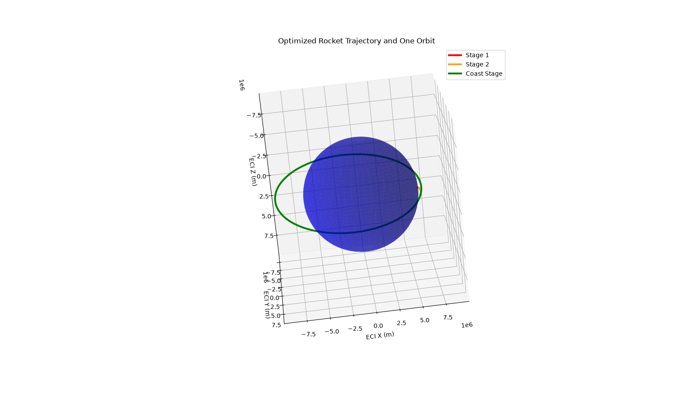
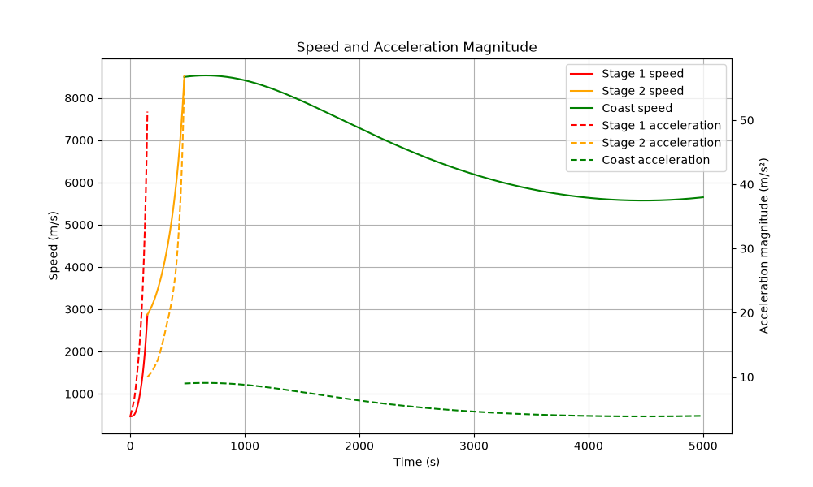
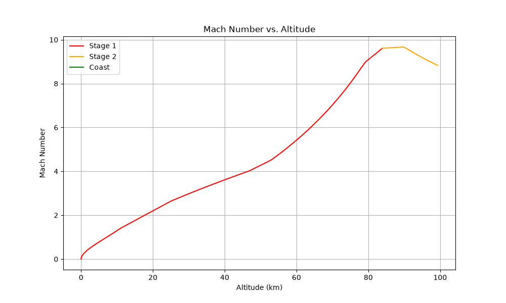
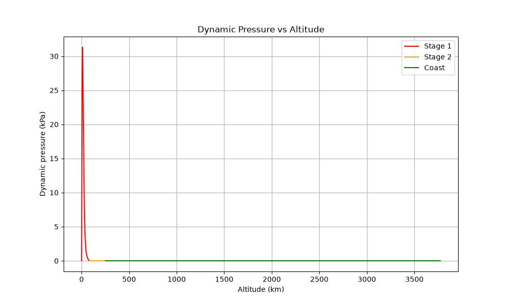
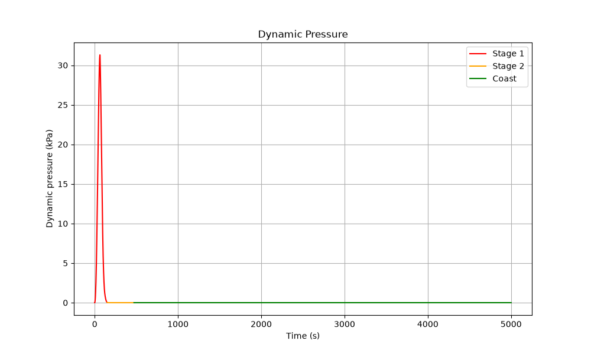
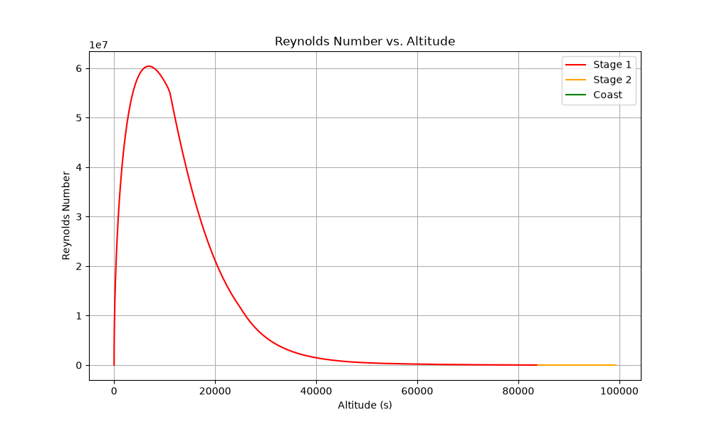

# Rocket Trajectory Optimizer

Python simulation and trajectory optimizer of a two_stage rocket










## Features

- Simulates a two_stage rocket launch/staging events

- Models thrust, atmospheric drag, variable gravity, variable mass
- Propagates the trajectory using SciPy numerical integration
- Optimizes the pitch guidance and second-stage cutoff time in order to achieve correct semi-major axis length (a), eccentricity (e), and inclination (i)

## Tools used

- Python
- NumPy
- SciPy
- Matplotlib

## The Way It Works

Simulation solves rocket's equation of motion over three stages:

1. First-stage (powered)
2. Second stage (powered)
3. Unpowered (Orbital Coast)

A differential-evolution optimizer adjusts the pitch parameters and second stage cutoff time to get to target orbit

##

```bash
git clone https://github.com/YOUR-USERNAME/rocket-trajectory-optimizer.git
cd rocket-trajectory-optimizer
pip install -r requirements.txt
